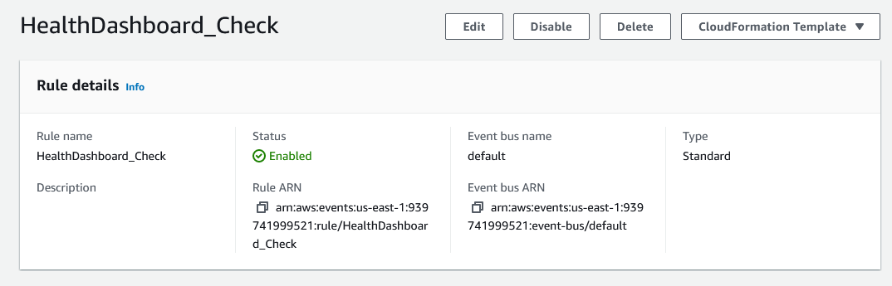
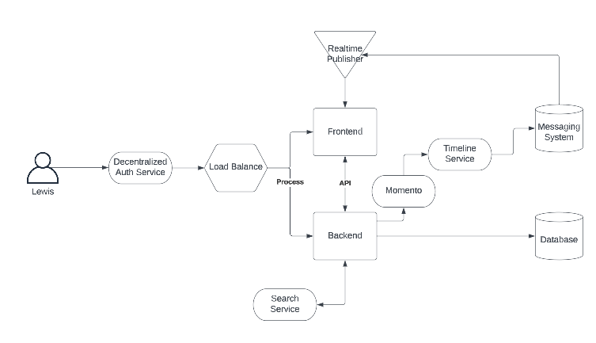
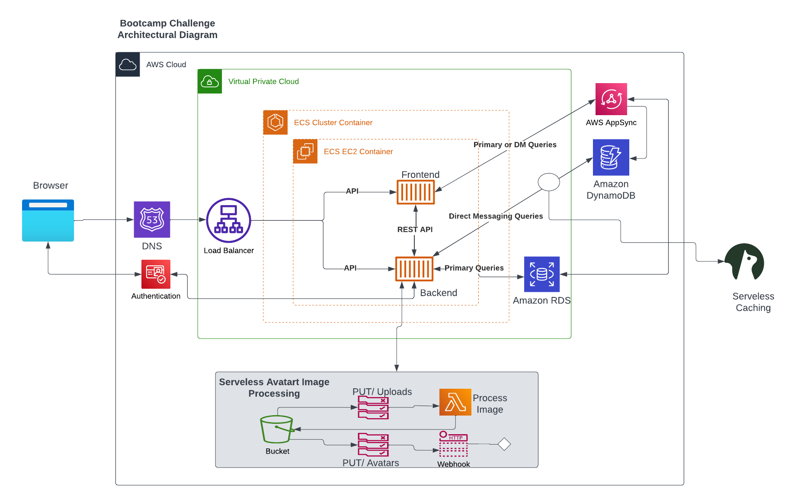
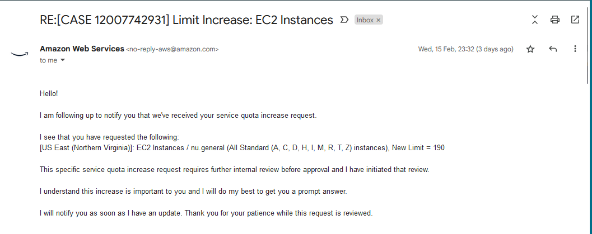
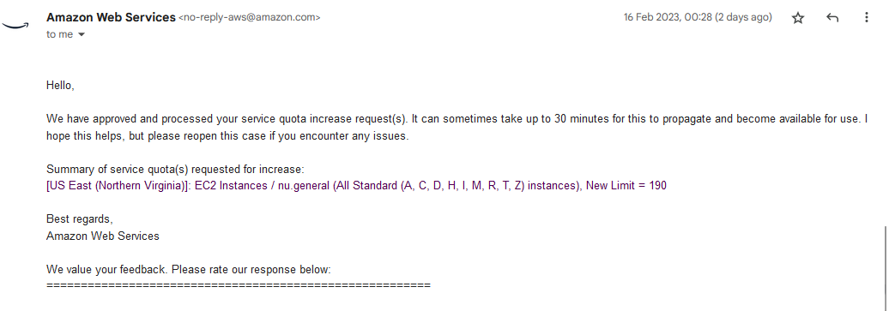

# Week 0 — Billing and Architecture
## Homework Challenges and Tasks

### 1. Destroy your root account credentials, Set MFA, IAM role
As the I had not configured Access key for the root user, I went on the the second step and set up MFA with google authenticator app.
I then created a IAM User I will be using and set it up with a password, console and billing access.
I Logged into the IAM role set up and configured and downloaded the Access and Secret key
The next step was setting up the gitpod account, using the AWS configure, then saved the configurations in the ENV of gitpod


### 2. Use EventBridge to hookup Health Dashboard to SNS and send notification when there is a service health issue.
Created an Event Bridge Health Check that would send me emails when there are issues 


### 3. Create an architectural diagram 
Using Lucid Charts I created this 2 diagrams, a conceptual diagram and Architectural Diagram

Lucid link to the [The Conceptual diagram](https://lucid.app/lucidchart/fc6a6c35-2fda-4d9c-9bfa-8fd54a4667a8/edit?viewport_loc=-736%2C-148%2C2220%2C970%2C0_0&invitationId=inv_ff3a1391-e017-413c-bf7c-1712f973fc45)



Lucid link to the [The Architectural Diagram](https://lucid.app/lucidchart/9ca79677-eaca-42f1-b7b4-8de21fa475cc/edit?viewport_loc=84%2C356%2C2220%2C970%2C0_0&invitationId=inv_94040091-7a0c-4fea-b245-3df287b2ad6b)



### 4. Open a support ticket and request a service limit
Requested and got an approval of a service increase request of vCPUs
The Request email:


The Approved email:


### 5. Working with gitpod
```
aws budgets create-budget \
    --account-id 939741999521 \
    --budget file://aws/json/budget.json \
    --notifications-with-subscribers file://aws/json/budget_notification.json
```
