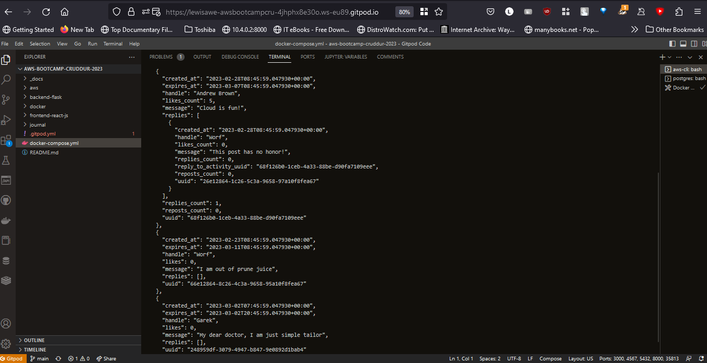

# Week 1 — App Containerization

## Docker Containerization

Docker is a containerization platform that allows developers to easily create, deploy, and run applications in containers. Containers are lightweight, portable, and self-contained environments that include everything an application needs to run, such as code, libraries, and system tools.

Docker provides a simple and efficient way to package an application into a container image that can be deployed on any platform or cloud infrastructure that supports Docker. This means that developers can build, test, and deploy their applications consistently across different environments, without having to worry about the underlying infrastructure.

Docker also provides a range of tools and services that make it easy to manage containers, such as Docker Compose for orchestrating multi-container applications, Docker Swarm for managing clusters of Docker hosts, and Docker Hub for sharing and discovering container images.

Overall, Docker has become a popular tool among developers and DevOps teams because of its ability to simplify the process of building, testing, and deploying applications, while also providing a consistent and reliable runtime environment.

###

#### Set Up notifications for the Cruddur App and added a sample notification


### Containerized both the backend and frontend images 
Through docker compose yml file ran and made sure the app ran

```
docker compose up
or
docker compose-up
```



### SET up DynamoDB and Postgress

Set up the Dynamodb and postgress database and made sure it worked


## DockerHUb

#### Ran the docker push command and uploaded the docker images to docker hub

Pushed the docker image at dockerhub

back-end docker hub images 
https://hub.docker.com/repository/docker/lewisawe/backend/general


front-end docker hub images 
https://hub.docker.com/repository/docker/lewisawe/cruddur-app/general


In My local machine I pulled the images and did the Docker Run for both apps

```
docker pull lewisawe/cruddur-app:latest
docker pull lewisawe/backend:latest
docker run -p 3000:3000 lewisawe/cruddur-app:latest
docker run -p 4567:4567 lewisawe/backend:latest
```
Managed to make the frontend work, trying to make backend communicate with the frontend in order to show the data


