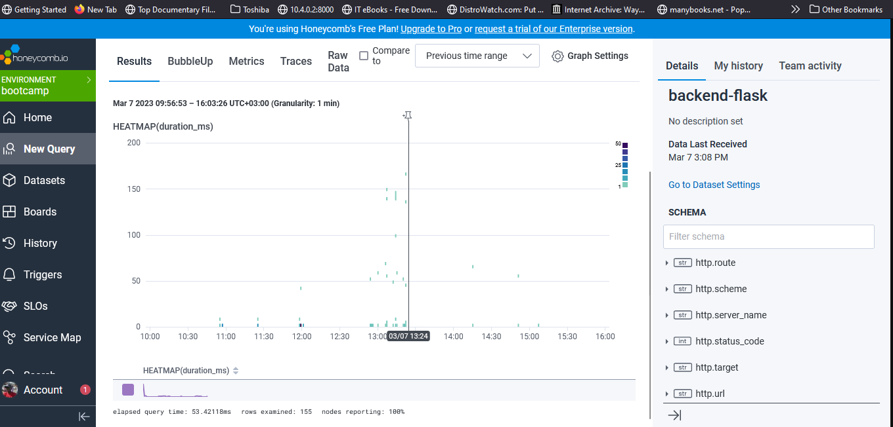
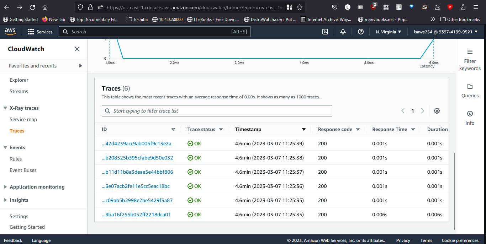
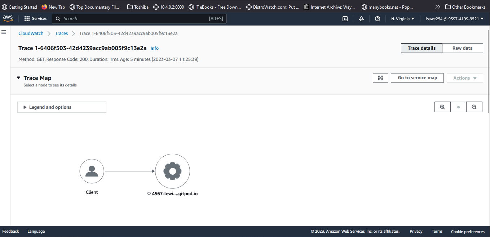
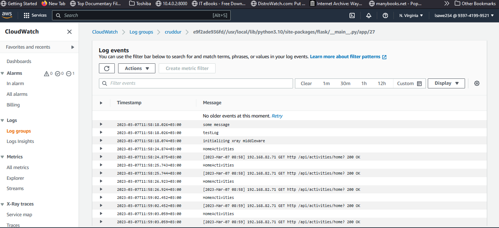
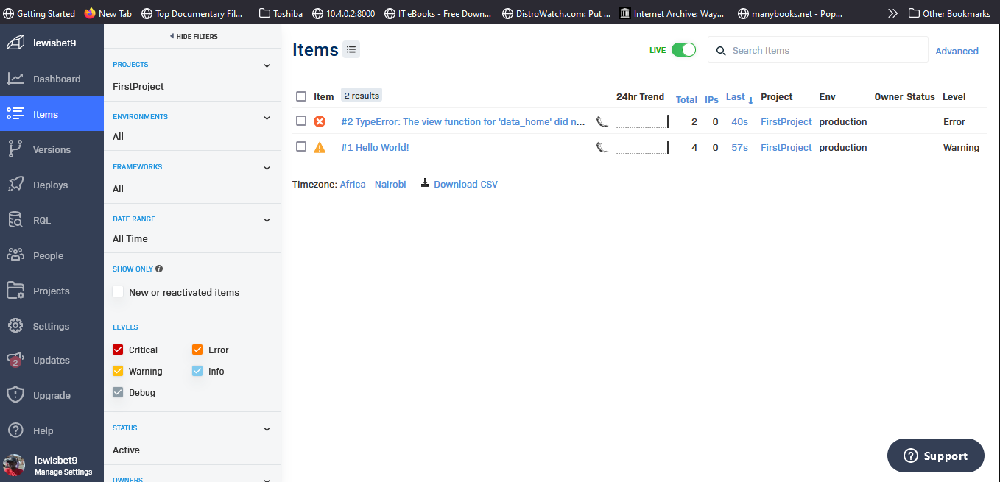

# Week 2 — Distributed Tracing

Distributed tracing is a method of monitoring and profiling microservices-based applications, allowing developers to identify and troubleshoot performance issues across multiple components of the application.

In a distributed tracing system, each transaction or request made by the application is assigned a unique identifier, called a trace ID. This trace ID is passed along with the request as it flows through the various components of the application. Each component of the application logs information about the request and passes that information along to the next component.

At the end of the request, all of the logs are combined and displayed in a trace view, providing a complete picture of the request's journey through the application. This trace view allows developers to see where the request spent the most time, which components are causing performance issues, and where bottlenecks are occurring.

Distributed tracing is an essential tool for developers working with modern, distributed applications that use microservices, as it allows them to quickly and accurately identify and resolve performance issues.

## Honeycomb

Configured Honeycomb by loging into in the honeycomb website, created a Honeycomb environment, then generated an the API key, which would be used with OpenTelemetary

## X-Ray

Also did X-Ray Configurations and made sure that it worked with the environment set in aws 

An X-Tray Trace Map

And an X-Ray Segment

## Cloudwatch Logs

Implemented Cloudwatch Logs to get direct logging for the Cruddur App

## Rollbar

Implementing observability with rollbar 

