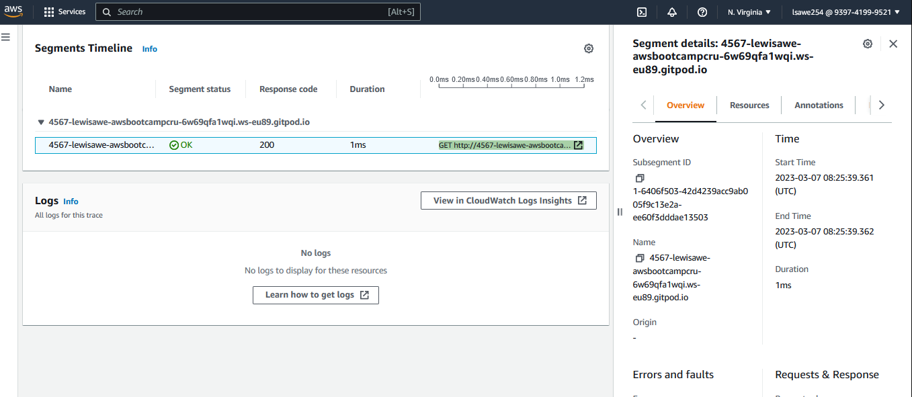

# Week 2 — Distributed Tracing

## Honeycomb

Configured Honeycomb by loging into in the honeycomb website, created a Honeycomb environment, then generated an the API key, which would be used with OpenTelemetary

## X-Ray

Also did X-Ray Configurations and made sure that it worked with the environment set in aws 

An X-Tray Trace Map

And an X-Ray Segment

## Cloudwatch Logs

Implemented Cloudwatch Logs to get direct logging for the Cruddur App

## Rollbar

Implementing observability with rollbar 

