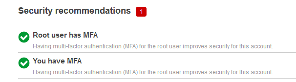

# Week 3 — Decentralized Authentication

## COGNITO

AWS Cognito is a user authentication and authorization service provided by Amazon Web Services (AWS). It allows developers to add user sign-up, sign-in, and access control to their web and mobile applications quickly and easily.

Cognito offers features such as user registration and login, social identity providers (such as Facebook and Google), multi-factor authentication, and user data synchronization across devices. Additionally, it supports both JSON Web Tokens (JWTs) and OAuth 2.0 access tokens for secure access to APIs and resources.

Cognito can also be integrated with other AWS services such as AWS Lambda, Amazon API Gateway, and Amazon S3 to create fully managed serverless applications. It provides a scalable and secure solution for managing user authentication and authorization in modern applications.

## Steps to set up

Install AWS Amplify in frontend folder, 

```
npm i aws-amplify --save
```

### Create a Cognito users pool in the AWS Console

- Located in Amazon Cognito
- Create a news user pool
- Use default Cognito User pool
- For signin options use user name and email
- next
- Password policies leave as default
- For Multi-factor Authentication choose no MFA, 
- User account recovery leave as default, self service recovery
- Delivery method of account recovery use email, other options may incur cost
- Configure sign up experience leave default, self service sign up
- Allow cognito to verify
- use email
- Required attributes
  - name 
  - preffered_username
- Configure message delivery check send email with cognito
- Intergrate your app
- User pool name - cruddur-user-pool
- dont use cognito hosted ui
- app type select public client
- app client name - cruddur
- review and create user pool

### CONFIGURE AMPLIFY

configure Frontend-react-js >> src >> App.js

In the docker-compose.yml file add the code at the frontend-react-js enviroment variables
-user pool and client ID are found in the AWS Conginto Console

### Conditionally show components based on logged in or logged out

-configure frontend-react-js 'HomeFeedPage.js'
-configure frontend-react-js ProfielInfo.js
-configure frontend-react-js SigninPage.js


### return to AWS Cognito console

- Create a new user
- enter new username
- enter email address
- set a password according to policies

After successfull set up, delete the user in the console and now try to register a new user in the website

### return to AWS Cognito console

- Create a new user
- enter new username
- enter email address
- set a password according to policies

### Congito JWT Server side Verify


### UI Changes 
 
 
