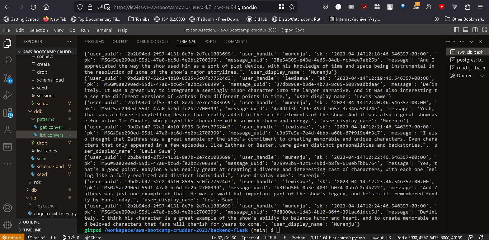

# Week 5 — DynamoDB and Serverless Caching

Amazon DynamoDB is a fully managed NoSQL database service provided by AWS. It is designed to be fast, flexible, and highly scalable, making it a popular choice for applications that require low-latency data access and storage. It's is a non-relational, key-value store database that can handle large volumes of structured and semi-structured data. It allows developers to store and retrieve data using a primary key, and also provides secondary indexes that allow for efficient querying of data based on non-key attributes.

## Implimentation of DynamoDB

