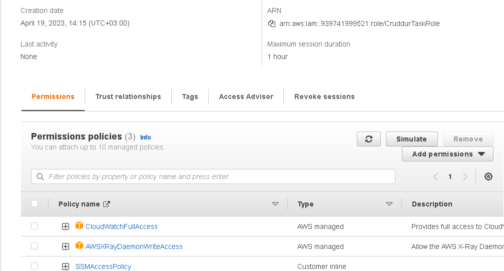

# Week 6 — Deploying Containers

AWS Containers is a suite of container management services provided by AWS to help developers deploy and manage containerized applications. Containers are a type of lightweight virtualization technology that allows developers to package their applications and their dependencies in a portable and consistent way.

AWS Containers includes, Amazon Elastic Container Service (ECS), Amazon Elastic Kubernetes Service (EKS), and AWS Fargate. These services provide a range of options for deploying, scaling, and managing containers on AWS.

Amazon Elastic Container Service (ECS) is a fully-managed container orchestration service that supports Docker containers. It enables developers to easily deploy and manage applications in a highly scalable and cost-effective way. ECS can be used to run containerized applications on a cluster of EC2 instances or on AWS Fargate, a serverless compute engine for containers.

Amazon Elastic Kubernetes Service (EKS) is a fully-managed Kubernetes service that makes it easy to deploy, manage, and scale containerized applications using Kubernetes. EKS enables developers to focus on writing applications rather than managing the underlying infrastructure.

AWS Fargate is a serverless compute engine for containers that allows developers to run containers without managing servers or clusters. With Fargate, developers can focus on building and deploying their applications without worrying about the underlying infrastructure.

      
## IMPLEMENTATION

* create a script to test RDS Connection named test
located bin/db/
and chmod u+x 
```
#!/usr/bin/env python3

import psycopg
import os
import sys

connection_url = os.getenv("CONNECTION_URL")

conn = None
try:
  print('attempting connection')
  conn = psycopg.connect(connection_url)
  print("Connection successful!")
except psycopg.Error as e:
  print("Unable to connect to the database:", e)
finally:
  conn.close()
  
```

* Add a healch check in the backend app.py

```
@app.route('/api/health-check')
def health_check():
  return {'success': True}, 200
  
```
* Create a new folder
backend-flask/bin/flask
a script named 'health-check'
and chmod u+x 
```
#!/usr/bin/env python3

import urllib.request

try:
  response = urllib.request.urlopen('http://localhost:4567/api/health-check')
  if response.getcode() == 200:
    print("[OK] Flask server is running")
    exit(0) # success
  else:
    print("[BAD] Flask server is not running")
    exit(1) # false
# This for some reason is not capturing the error....
#except ConnectionRefusedError as e:
# so we'll just catch on all even though this is a bad practice
except Exception as e:
  print(e)
  exit(1) # false
  
```

* Create CloudWatch Logs in CLI with

```
aws logs create-log-group --log-group-name "cruddur"
aws logs put-retention-policy --log-group-name "cruddur" --retention-in-days 1

```


## Creating ECS Cluster
AWS CLI command to create a ECS cluster named cruddur
```
aws ecs create-cluster \
--cluster-name cruddur \
--service-connect-defaults namespace=cruddur

```


## Creating a repository

### For python
```
aws ecr create-repository \
  --repository-name cruddur-python \
  --image-tag-mutability MUTABLE
```
### Log-in into ECR

```
aws ecr get-login-password --region $AWS_DEFAULT_REGION | docker login --username AWS --password-stdin "$AWS_ACCOUNT_ID.dkr.ecr.$AWS_DEFAULT_REGION.amazonaws.com"
```

### Set URL and Echo it to ensure it's working

```
export ECR_PYTHON_URL="$AWS_ACCOUNT_ID.dkr.ecr.$AWS_DEFAULT_REGION.amazonaws.com/cruddur-python"
echo $ECR_PYTHON_URL
```

### Docker pull

```
docker pull python:3.10-slim-buster
```

### Tag Image

```
docker tag python:3.10-slim-buster $ECR_PYTHON_URL:3.10-slim-buster
```

### Push Image

```
docker push $ECR_PYTHON_URL:3.10-slim-buster
```

### Copy your URI from console and Add to the Dockerfile

```
# Similar to this
FROM 387543059434.dkr.ecr.ca-central-1.amazonaws.com/cruddur-python:3.10-slim-buster
```
The docker compose-up

```
docker compose up backend-flask db
```

Create a repo for backend-flask

```
aws ecr create-repository \
  --repository-name backend-flask \
  --image-tag-mutability MUTABLE
```


### Set the URL

```
export ECR_BACKEND_FLASK_URL="$AWS_ACCOUNT_ID.dkr.ecr.$AWS_DEFAULT_REGION.amazonaws.com/backend-flask"
echo $ECR_BACKEND_FLASK_URL
```

### Build the image, ensure you are in the right directory

```
docker build -t backend-flask .
```
### Tag the image

```
docker tag backend-flask:latest $ECR_BACKEND_FLASK_URL:latest
```

### Push Image

```
docker push $ECR_BACKEND_FLASK_URL:latest
```


Set up sensitive data to task definations

```
aws ssm put-parameter --type "SecureString" --name "/cruddur/backend-flask/AWS_ACCESS_KEY_ID" --value $AWS_ACCESS_KEY_ID
aws ssm put-parameter --type "SecureString" --name "/cruddur/backend-flask/AWS_SECRET_ACCESS_KEY" --value $AWS_SECRET_ACCESS_KEY
aws ssm put-parameter --type "SecureString" --name "/cruddur/backend-flask/CONNECTION_URL" --value $PROD_CONNECTION_URL
aws ssm put-parameter --type "SecureString" --name "/cruddur/backend-flask/ROLLBAR_ACCESS_TOKEN" --value $ROLLBAR_ACCESS_TOKEN
aws ssm put-parameter --type "SecureString" --name "/cruddur/backend-flask/OTEL_EXPORTER_OTLP_HEADERS" --value "x-honeycomb-team=$HONEYCOMB_API_KEY"
```


### Create a IAM Role

Create a file in aws/policies/service-execution-role
```
{
    "Version":"2012-10-17",
    "Statement":[{
      "Effect": "Allow",
      "Action": [
        "ssm:GetParameters",
        "ssm:GetParameter"
      ],
      "Resource": "arn:aws:ssm:us-east-1:939741999521:parameter/cruddur/backend-flask/*"
    }]
  }
```
Create a file in aws/policies/service-assume-role-execution-policy.json

Execute CLI to create role

```
aws iam create-role --role-name CruddurServiceExecutionRole --assume-role-policy-document file://aws/policies/service-assume-role-execution-policy.json
```

Execute CLI to put role

```
aws iam put-role-policy --policy-name CruddurServiceExecutionPolicy --role-name CruddurServiceExecutionRole --policy-document file://aws/policies/service-execution-policy.json
```
### Register Task Definitions Backend

```
aws ecs register-task-definition --cli-input-json file://aws/task-definitions/backend-flask.json
```

CLI to grab default VPC
```
export DEFAULT_VPC_ID=$(aws ec2 describe-vpcs \
--filters "Name=isDefault, Values=true" \
--query "Vpcs[0].VpcId" \
--output text)
echo $DEFAULT_VPC_ID
```

CLI to grab default subnet
```
export DEFAULT_SUBNET_IDS=$(aws ec2 describe-subnets  \
 --filters Name=vpc-id,Values=$DEFAULT_VPC_ID \
 --query 'Subnets[*].SubnetId' \
 --output json | jq -r 'join(",")')
echo $DEFAULT_SUBNET_IDS
```

Create a security Group

```
export CRUD_SERVICE_SG=$(aws ec2 create-security-group \
  --group-name "crud-srv-sg" \
  --description "Security group for Cruddur services on ECS" \
  --vpc-id $DEFAULT_VPC_ID \
  --query "GroupId" --output text)
echo $CRUD_SERVICE_SG
```

authorize security groups

```
aws ec2 authorize-security-group-ingress \
  --group-id $CRUD_SERVICE_SG \
  --protocol tcp \
  --port 80 \
  --cidr 0.0.0.0/0
```

Create a file in aws/json/service-backend.json to create a new service 

```
{
    "cluster": "cruddur",
    "launchType": "FARGATE",
    "desiredCount": 1,
    "enableECSManagedTags": true,
    "enableExecuteCommand": true,
    "networkConfiguration": {
      "awsvpcConfiguration": {
        "assignPublicIp": "ENABLED",
        "securityGroups": [
          "sg-08cb54773bf6adff8"
        ],
        "subnets": [
            "subnet-0d9bca497abea1425",
            "subnet-00a52828946aa7649",
            "subnet-0a201aa360ea1d0a1"

        ]
      }
    },
    "propagateTags": "SERVICE",
    "serviceName": "backend-flask",
    "taskDefinition": "backend-flask"
}
```

Run the json

```
aws ecs create-service --cli-input-json file://aws/json/service-backend-flask.json
```

Run this to verify you can access container 

```
aws ecs execute-command  \
--region $AWS_DEFAULT_REGION \
--cluster cruddur \
--task 848f58d4995740bbbe567113e437552d \
--container backend-flask \
--command "/bin/bash" \
--interactive
```

### Login into ECR

```
aws ecr get-login-password --region $AWS_DEFAULT_REGION | docker login --username AWS --password-stdin "$AWS_ACCOUNT_ID.dkr.ecr.$AWS_DEFAULT_REGION.amazonaws.com"
```

### Create frontend service

```
aws ecs create-service --cli-input-json file://aws/json/service-frontend-react-js.json
```
remove the load balancer from the service-frontend-react-js.json Load Balacer 
```
    "loadBalancers": [
        {
            "targetGroupArn": "arn:aws:elasticloadbalancing:us-east-1:939741999521:targetgroup/cruddur-frontend-react-js/67f9fb27cefa7845",
            "containerName": "frontend-react-js",
            "containerPort": 3000
        }
      ],
```

Build the image adding the Custom Domain

```
### Docker Build docker build \
--build-arg REACT_APP_BACKEND_URL="https://api.cloudsafari.live" \
--build-arg REACT_APP_AWS_PROJECT_REGION="$AWS_DEFAULT_REGION" \
--build-arg REACT_APP_AWS_COGNITO_REGION="$AWS_DEFAULT_REGION" \
--build-arg REACT_APP_AWS_USER_POOLS_ID="us-east-1_hbta4pLNM" \
--build-arg REACT_APP_CLIENT_ID="3sv2lv2b565t1j1lpt52q4h3j1" \
-t frontend-react-js \
-f Dockerfile.prod \
.
```


Docker push and tag

```
docker tag frontend-react-js:latest $ECR_FRONTEND_REACT_URL:latest
docker push $ECR_FRONTEND_REACT_URL:latest
```





