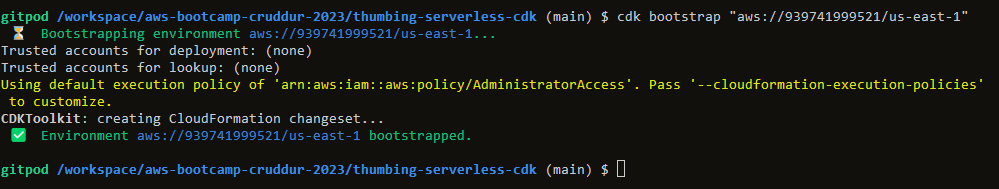
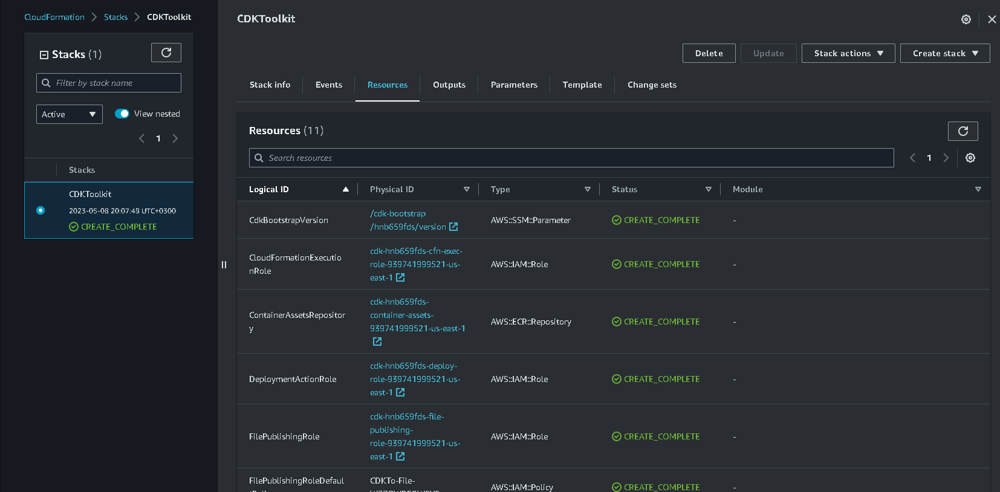
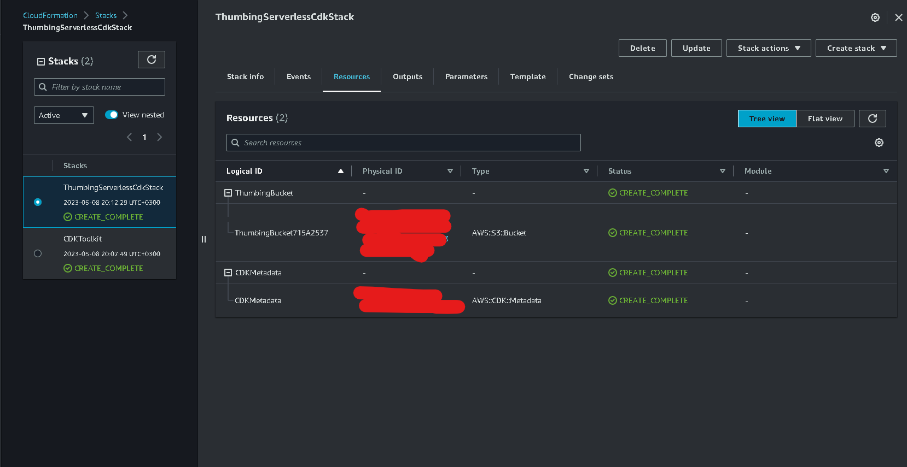
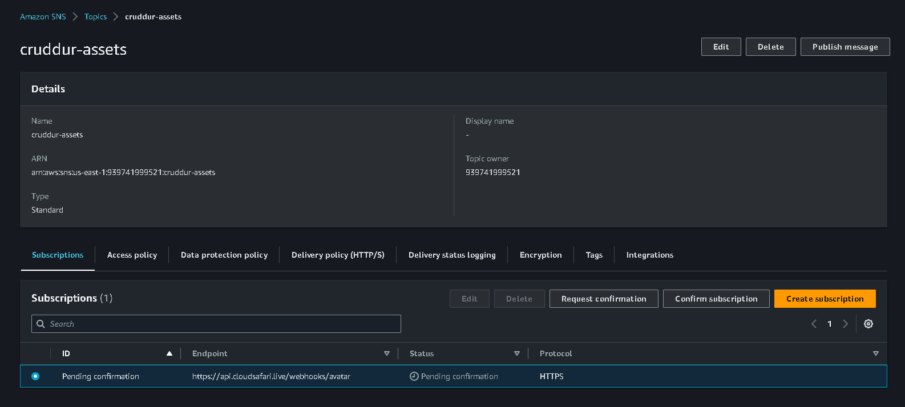
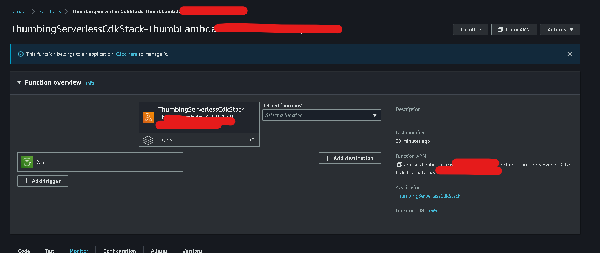
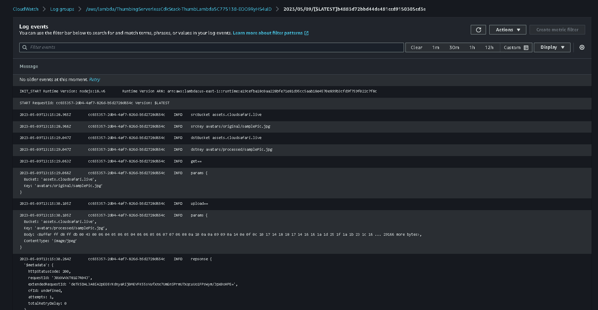
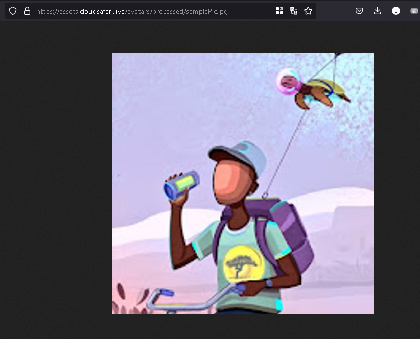
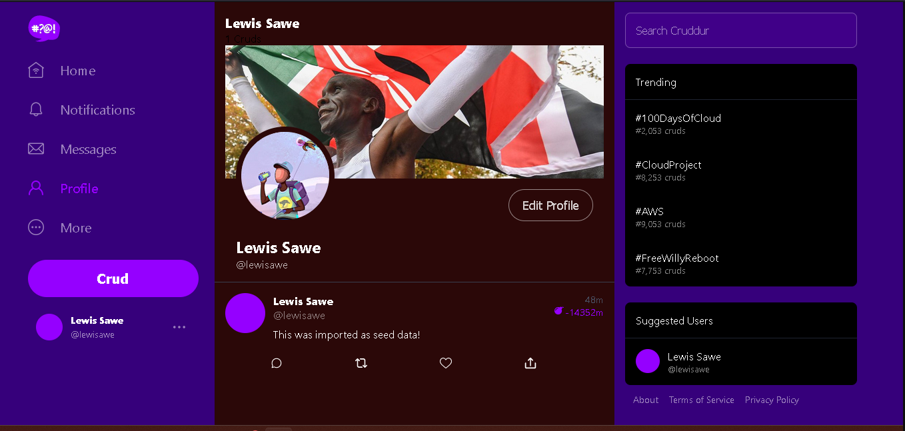
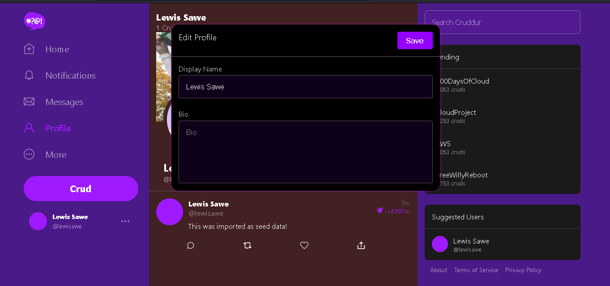

# Week 8 — Serverless Image Processing

Create a folder thumbing-serverless-cdk

npm install aws-cdk -g
```
npm install aws-cdk -g

```
In the thumbing-serveless folder

Initialize the CDk with this command
```
cdk init app --language typescript
```

edit thumbing-serveless-cdk-stacks.ts

```
import * as cdk from 'aws-cdk-lib';
import * as s3 from 'aws-cdk-lib/aws-s3';
import * as lambda from 'aws-cdk-lib/aws-lambda';
import { Construct } from 'constructs';
import * as dotenv from 'dotenv';

dotenv.config();

export class ThumbingServerlessCdkStack extends cdk.Stack {
  constructor(scope: Construct, id: string, props?: cdk.StackProps) {
    super(scope, id, props);

    // The code that defines your stack goes here
    const bucketName: string = process.env.THUMBING_BUCKET_NAME as string;
    const functionPath: string = process.env.THUMBING_FUNCTION_PATH as string;
    const folderInput: string = process.env.THUMBING_S3_FOLDER_INPUT as string;
    const folderOutput: string = process.env.THUMBING_S3_FOLDER_OUTPUT as string;

    const bucket = this.createBucket(bucketName);
    const lambda = this.createLambda(functionPath, bucketName, folderInput, folderOutput);

  }

  createBucket(bucketName: string): s3.IBucket {
    const bucket = new s3.Bucket(this, 'ThumbingBucket', {
      bucketName: bucketName,
      removalPolicy: cdk.RemovalPolicy.DESTROY
    });
    return bucket;
  }

  createLambda(functionPath: string, bucketName: string, folderInput: string, folderOutput: string): lambda.IFunction {
    const lambdaFunction = new lambda.Function(this, 'ThumbLambda', {
      runtime: lambda.Runtime.NODEJS_18_X,
      handler: 'index.handler',
      code: lambda.Code.fromAsset(functionPath),
      environment: {
        DEST_BUCKET_NAME: bucketName,
        FOLDER_INPUT: folderInput,
        FOLDER_OUTPUT: folderOutput,
        PROCESS_WIDTH: '512',
        PROCESS_HEIGHT: '512'
      }
    });
    return lambdaFunction;
  } 

}
```

run

```
cdk synth
```

Bootstrap the account

```
cdk bootstrap "aws://939741999521/us-east-1"
```

import dotenv

```
npm i dotenv 
```










